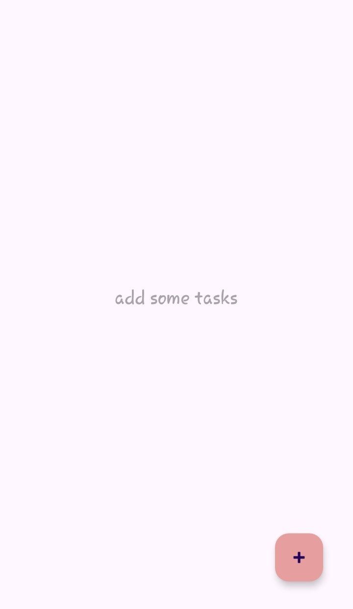
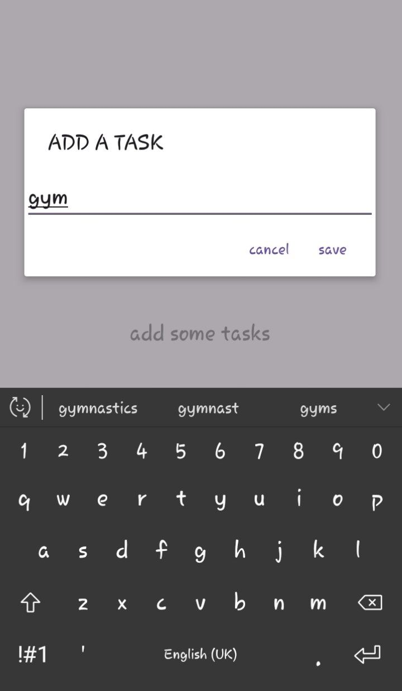
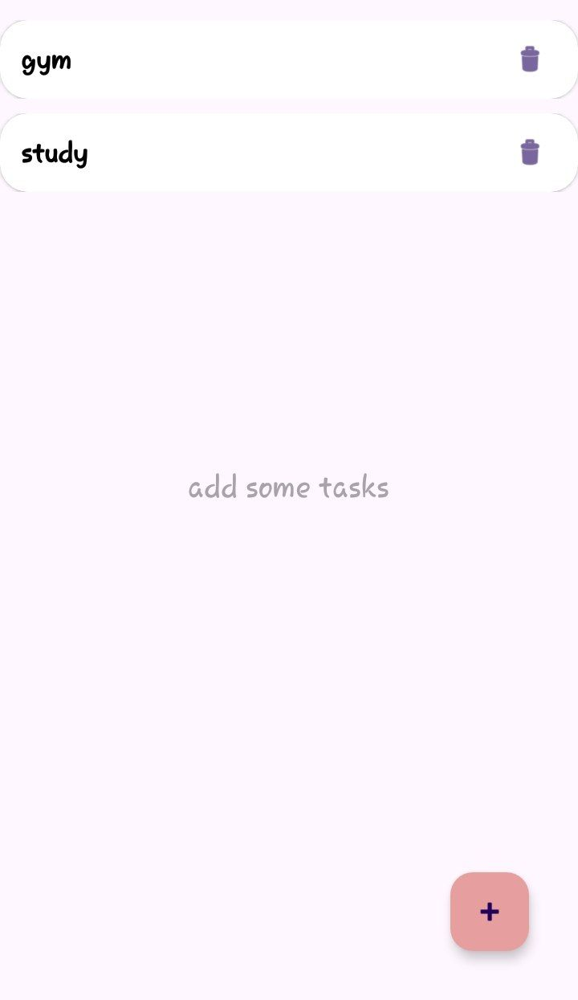

<h1>TodoList Android Application</h1>
 

This is a simple TodoList android application, this app utilizes Room database for local storage enabling users to add, view and delete tasks.
 

<h2>Features</h2>

Add Tasks: Easily add new tasks to your to-do list.

View Tasks: View a list of all your tasks.

Delete Tasks: Remove tasks from your list.

Local Storage: Utilizes Room database for persistent local storage.

 
<h2>Technologies Used</h2>
Java Programming language 

Room Database

## App Preview

### Home Screen

### Adding Tasks

### Tasks View

